# How Codegen Agents Work

Codegen agents follow a simple but powerful workflow: they're triggered from your existing tools, work in secure sandboxes to implement changes, create pull requests, and then monitor and fix any issues that arise. This creates a seamless development experience that integrates naturally with your team's existing processes.

## The Agent Happy Path

Here's how Codegen agents work from start to finish:

```mermaid
graph TD
    A[Trigger from Integration] --> B[Work in Remote Sandbox]
    B --> C[Create Pull Request]
    C --> D[Monitor CI Checks]
    D --> E[Auto-fix Failed Checks]
    E --> D
    D --> D1[All checks pass ✓]
    D1 --> G[Ready for Review]
    G --> F[Respond to Follow-up Questions]
    F --> G

    A1[Slack @mention] --> A
    A2[Linear issue assignment] --> A
    A3[GitHub issue comment] --> A
```

### 1. Users Trigger `@codegen` to Perform Tasks

Agents activate seamlessly from the platforms you already use:

* **[Slack](/integrations/slack)** - Tag `@codegen` in any channel or send a direct message
* **[Linear](/integrations/linear)** - Assign an issue to Codegen or mention it in comments
* **[Jira](/integrations/jira)** - Assign an issue to Codegen or mention it in comments
* **[ClickUp](/integrations/clickup)** - Assign a task to Codegen or mention it in comments
* **[Monday.com](/integrations/monday)** - Assign an item to Codegen or mention it in comments
* **[GitHub](/integrations/github)** - Comment on issues or PRs to request changes
* **[API](http://localhost:3001/api-reference/agents/create-agent-run)** - Programmatically trigger agents for automated workflows

### 2. `@codegen` Performs Work in Secure Sandboxes

Once triggered, agents work in **[isolated sandbox environments](/sandboxes/overview)** where they can:

* Execute code safely without affecting your systems
* Install dependencies and run tests
* Make changes and validate them before committing
* Access your repository context while maintaining security

### 3. Users Receive Completed Pull-Requests

Agents create **[GitHub pull requests](/integrations/github)** with:

* Detailed descriptions explaining the changes
* Links back to the original request (Linear issue, Slack thread, etc.)
* Clean, tested code ready for review
* Proper commit messages following your conventions

### 4. Agents Monitor and Auto-fix PR Issues

The **[Checks Auto-fixer](/capabilities/checks-autofixer)** ensures quality by:

* Monitoring CI/CD pipeline results in real-time
* Automatically analyzing build failures and test errors
* Pushing targeted fixes to resolve issues
* Retrying up to 3 times before escalating to humans

### 5. Agents Respond to Follow-ups

Agents remain active to handle questions and refinements:

* Respond to PR review comments with additional changes
* Answer questions in the original Slack thread or Linear issue
* Make adjustments based on feedback from team members
* Provide explanations of their implementation decisions

## Configuration & Customization

Codegen agents can be customized to match your team's specific workflows and requirements:

### Model Selection

Choose from leading AI models and configure custom API keys to optimize performance and cost for your organization.

<Card title="Model Choice" icon="cpu" href="/settings/model-configuration">
  Select LLM providers, configure custom API keys, and optimize performance
  settings.
</Card>

### Agent Behavior

Control how agents interact with users and approach code modifications to ensure they align with your team's preferences.

<Card title="Agent Behavior" icon="robot" href="/settings/agent-behavior">
  Configure plan proposals, GitHub mention requirements, and interaction
  patterns.
</Card>

### Security & Permissions

Define what actions agents are allowed to perform across your organization with fine-grained permission controls.

<Card title="Agent Permissions" icon="shield-check" href="/settings/agent-permissions">
  Control PR creation, rules detection, and enforce security policies like
  signed commits.
</Card>

<Tip>
  Start with conservative settings and gradually expand agent capabilities as
  your team becomes comfortable with AI assistance.
</Tip>

## Learn More

Dive deeper into specific capabilities:

* **[Get started with the overview](/introduction/overview)** - Complete introduction to Codegen
* **[Explore integrations](/integrations/integrations)** - See all available platforms and tools
* **[Understand sandboxes](/sandboxes/overview)** - Learn about the secure execution environment
* **[Configure settings](/settings/settings)** - Customize agent behavior and permissions
* **[View analytics](/capabilities/analytics)** - Monitor agent performance and impact
